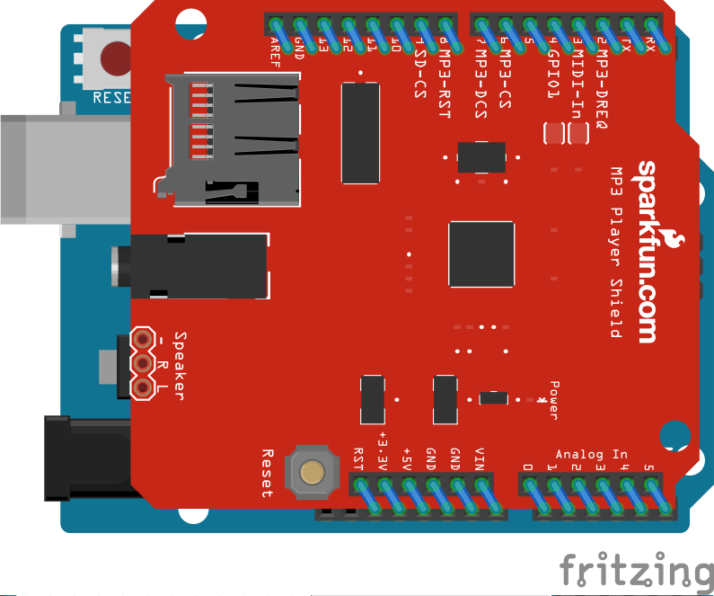

# Arduino 蓝牙音乐播放器

## 简介

使用手机蓝牙控制单片机播放存储在 microSD 上的音乐，可以实现暂停、快进快退、切换曲目、控制音量、切换播放模式等功能。

iOS app 由 Swift 编写，使用了苹果的 `Core Bluetooth` API，该框架只支持蓝牙 4.0（BLE），且要求操作系统在 iOS 5 以上。Arduino 代码使用了硬件商 Seeed Studio 的官方库 `MusicPlayer`。

这是我 2015 年暑期 Arduino 课程的实践作业。

## 设备

* DFRobot Bluno (Arduino + 蓝牙 4.0)
* Seeed Music Shield (音乐扩展板)
* iPhone (iOS 5+)
* 迷你音响

## 示意图

## 参考资料

* [Bluno SKU:DFR0267 - DFRobot Wiki](http://www.dfrobot.com/wiki/index.php/Bluno_SKU:DFR0267)
* [Music Shield V2.0 - Seeed Wiki](http://www.seeedstudio.com/wiki/index.php?title=Music_Shield_V2.0&uselang=en)
* [Core Bluetooth Programming Guide - iOS Developer Library](https://developer.apple.com/library/ios/documentation/NetworkingInternetWeb/Conceptual/CoreBluetooth_concepts/AboutCoreBluetooth/Introduction.html)
